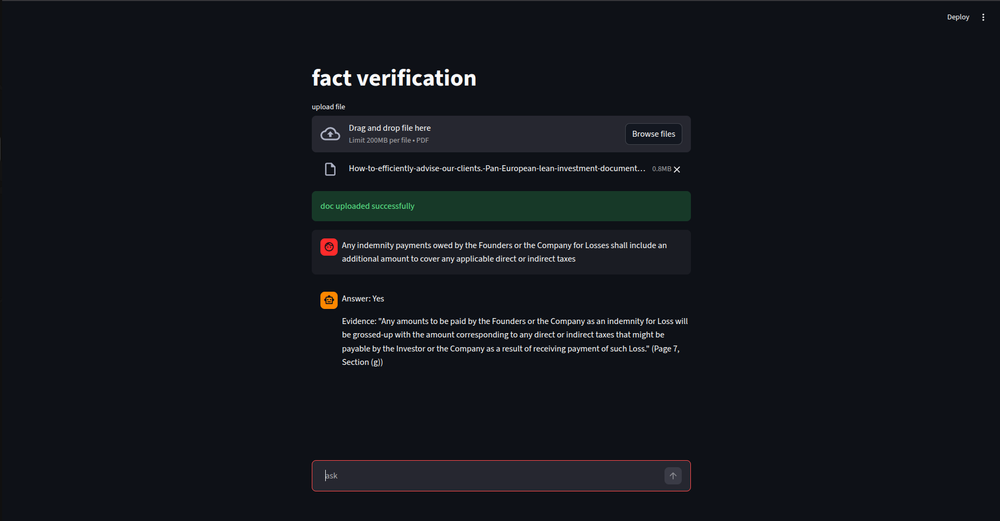
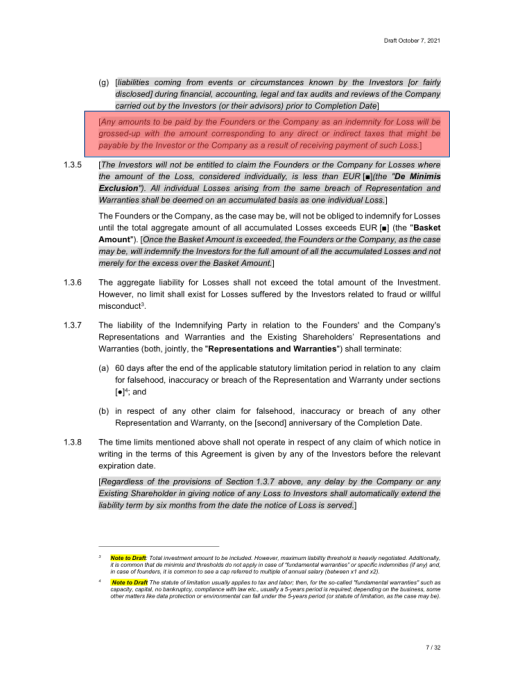
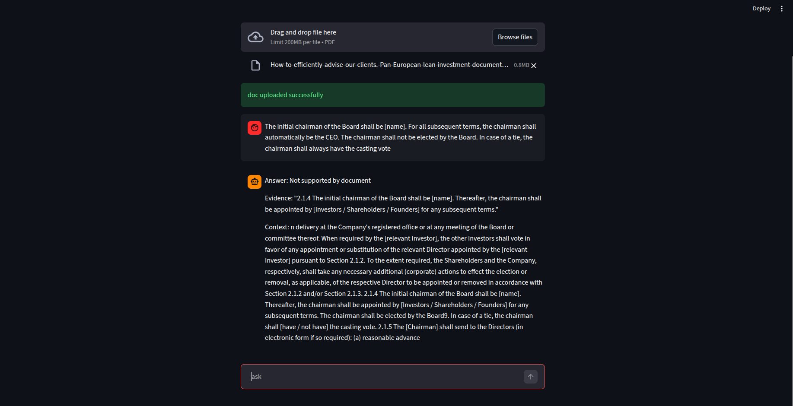
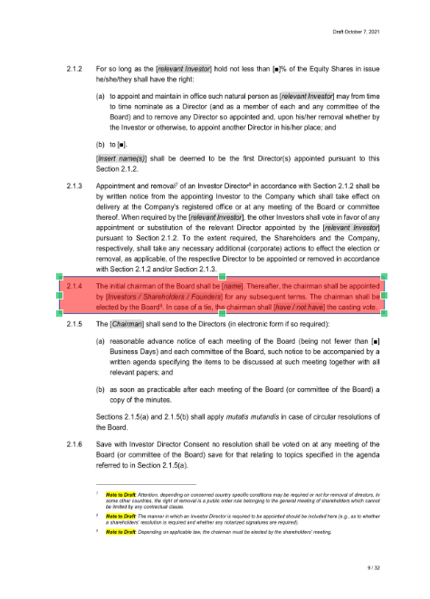
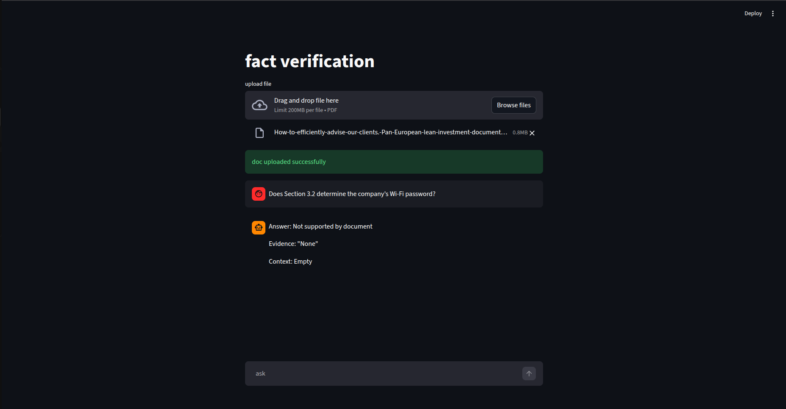

# Fact Verification Assistant

Built for learning purposes as part of exploring RAG (Retrieval Augmented Generation) with LangChain.

---

## Problem Statement

A user asks a yes/no question about a long document. The system answers and returns the exact supporting passage from the document. If no evidence exists, it says so explicitly.

Example:

```
Q: Does the policy allow refunds after 30 days?

Answer: Yes
Evidence:
"Refund requests may be submitted within 45 days of purchase."
(Page 12, Section 4.1)
```

---

## How It Works

1. User uploads a PDF
2. Document is chunked and embedded using `sentence-transformers/all-MiniLM-L6-v2` via FAISS
3. On a query, relevant chunks are retrieved and passed to the LLM as context
4. LLM answers strictly using the retrieved context — no external knowledge

---

## Stack

- LangChain (RAG chain, prompt templates, FAISS retriever)
- HuggingFace Embeddings (`all-MiniLM-L6-v2`)
- Groq (`llama-3.1-8b-instant`)
- Streamlit

---

## Setup

```bash
pip install -r requirements.txt
```

Add a `.env` file:

```
GROQ_API_KEY=your_key_here
```

Run:

```bash
streamlit run app2.py
```

---

## Test Results

Answer: Yes



Evidence for Yes



Answer: No



Evidence for No



Answer: Not Supported by Document



---

## Concepts Covered

- RAG pattern
- Vector similarity search with FAISS
- Prompt engineering for constrained output
- Streamlit session state management