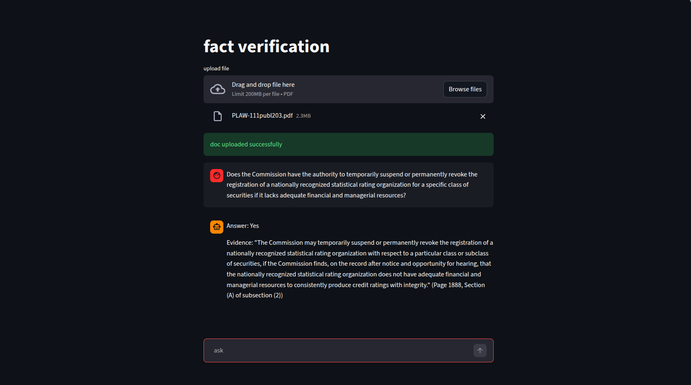
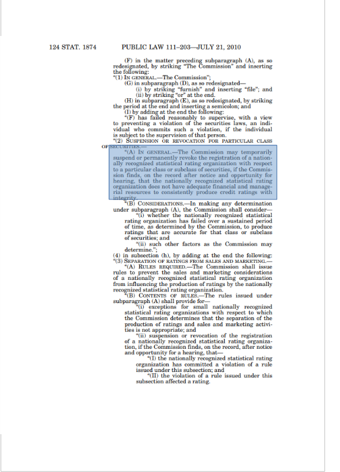

# Fact Verification RAG Assistant (Hybrid Search Edition)

This is a document fact-verification assistant built with Streamlit. You upload a PDF, ask a question, and the app tells you whether the document supports or contradicts your claim, along with the exact passage that backs up the answer.

The original version of this project used FAISS for retrieval, which is a dense vector search approach. This version replaces that with a hybrid search setup using Pinecone, which combines both dense and sparse retrieval. The reason for the switch is explained below.

---

## Why Hybrid Search

The first version worked well for general documents. But when tested on something like the Dodd-Frank Act (a US financial regulation document, 850+ pages, dense with legal and financial terminology), it struggled. Dense vector search by itself is good at semantic similarity but it can miss exact legal terms, section references, or specific financial jargon. Hybrid search adds a keyword-matching layer on top, so when someone asks about a specific clause or a precise regulatory term, it actually finds the right passage instead of something that just sounds related.

---

## Tech Used and What It Does

**LangChain**
A framework for chaining together LLM calls, retrievers, and prompt templates. We use it to wire up the retriever, the prompt, the model, and the output parser into a single callable pipeline.

**Pinecone**
A managed vector database. We store the document chunks here as vectors and retrieve them at query time. Unlike FAISS which lives in memory locally, Pinecone is cloud-hosted and persistent. The index is configured with `dotproduct` as the metric, which is required for hybrid search to work correctly with combined dense and sparse scores.

**PineconeHybridSearchRetriever**
This is the core addition over v1. It sends both a dense embedding and a sparse BM25 vector to Pinecone and gets back results that are scored on both. The `alpha` parameter controls the balance, where `alpha=0.35` means 35% weight on semantic (dense) and 65% on keyword (sparse). For a legal document full of exact terminology, leaning toward keyword matching made more sense.

**BM25Encoder**
BM25 stands for Best Match 25. It is a classical information retrieval algorithm from the pre-deep-learning era. It scores documents based on term frequency and inverse document frequency (TF-IDF style). You fit it on your corpus first, then it converts any query or document chunk into a sparse vector where each dimension corresponds to a vocabulary term. This is what gives the retriever its keyword-matching ability. We fit it on all the text chunks from the uploaded PDF and dump the learned values to `bm25_values.json` so they can be reloaded.

**HuggingFace Embeddings (all-MiniLM-L6-v2)**
This model converts text into dense 384-dimensional vectors that capture semantic meaning. Two sentences that mean the same thing even with different words will have similar vectors. This is the "dense" side of the hybrid search pair.

**Dense vs Sparse Vectors**
Dense vectors are fixed-size floating point arrays where every dimension has a value. Sparse vectors have mostly zeros, with nonzero values only at positions corresponding to words that actually appear. Dense is good for meaning, sparse is good for exact term matching. Hybrid search uses both.

**RecursiveCharacterTextSplitter**
Splits documents into smaller chunks before embedding. We used 800-character chunks with 150-character overlap. The overlap ensures that sentences split across chunk boundaries are not lost from context.

**RAG (Retrieval Augmented Generation)**
The overall pattern here. Instead of asking the LLM to answer from its training data, we retrieve relevant chunks from the actual document and pass them as context in the prompt. This means the LLM is grounded in the document's content and cannot make things up from general knowledge.

**Groq + LLaMA 3.1 8B**
We use Groq as the inference provider for the LLaMA 3.1 8B Instant model. Groq offers very fast inference speeds which makes the response feel close to real-time even for a document this large.

**Streamlit**
Used for the front-end. Handles file upload, chat interface, and session state management to persist the retriever across messages without re-indexing the document on each question.

---

## Project Structure (updated for new commit)

```text
REIMP/
├── app2.py              # Main Streamlit application
├── app3.py              # Alternate / experimental version
├── images_2/
│   ├── yes.png          # Output screenshot showing a supported claim
│   └── yessrc.png       # Output screenshot showing source evidence
├── inputpdf/            # Sample input PDFs
├── .gitignore
├── .python-version
├── requirements.txt
├── pyproject.toml
├── uv.lock
└── README.md
```

---

## Sample Document Tested

The primary test document was the Dodd-Frank Wall Street Reform and Consumer Protection Act (Public Law 111-203), a 850+ page US federal financial regulation statute. This was deliberately chosen because it is the kind of document where traditional dense-only retrieval tends to underperform. The document is full of precise legal language, section cross-references, and financial industry terms that need exact keyword matching to retrieve correctly.

PDF source: https://www.govinfo.gov/content/pkg/PLAW-111publ203/pdf/PLAW-111publ203.pdf

The retriever was able to return accurate and well-grounded passages from within such a large document, along with the exact source evidence the LLM used to answer. The prompt is structured to refuse answering if the context does not contain the claim, which prevents hallucination.

**Claim verified as supported:**



**Source evidence returned:**



---

## Setup

1. Clone the repo
2. Create a `.env` file with:
```
GROQ_API_KEY=your_groq_key
pinecone_key=your_pinecone_key
```
3. Install dependencies:
```bash
pip install -r requirements.txt
```
4. Run:
```bash
streamlit run app2.py
```

---

## What I Learned

The main takeaway from this project is that retrieval strategy matters a lot depending on the document type. Dense vector search alone is sufficient for most general Q&A scenarios, but for domain-specific documents (legal, financial, medical) where exact terminology is significant, combining it with sparse keyword search gives noticeably better results.

I also learned that tuning the `alpha` parameter for hybrid search is not trivial. It depends entirely on the document and the kinds of queries you expect. For the Dodd-Frank Act, keywords mattered more than semantic similarity, so a lower alpha worked better.

Another thing that became clear is how important the prompt structure is for a fact-verification use case specifically. The model needs to be explicitly told not to use external knowledge and to respond with "not supported by document" rather than guessing. Without that guardrail the outputs are not trustworthy for verification purposes.


## Updates
- Decoupled into FastAPI backend + Streamlit frontend
- Fixed Pinecone namespace isolation (chunks from different docs were mixing)
- Added multi-user session support via UUID namespaces
